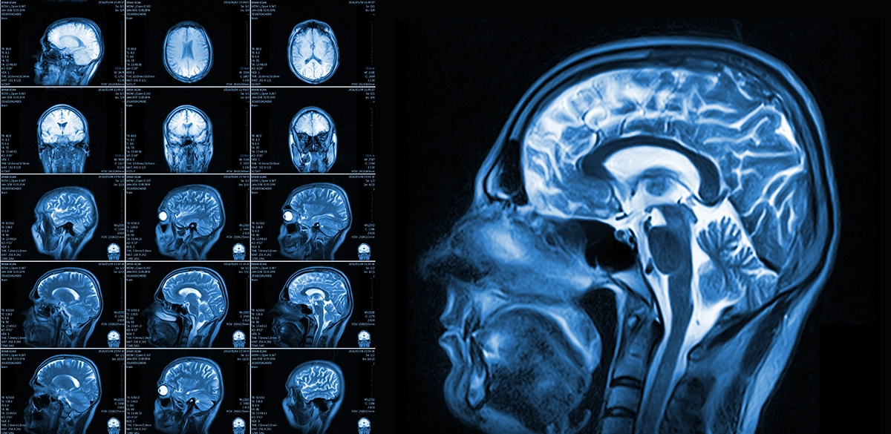
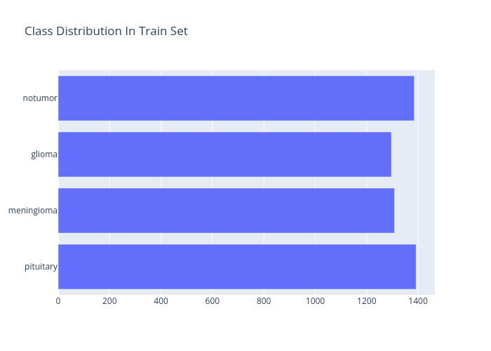
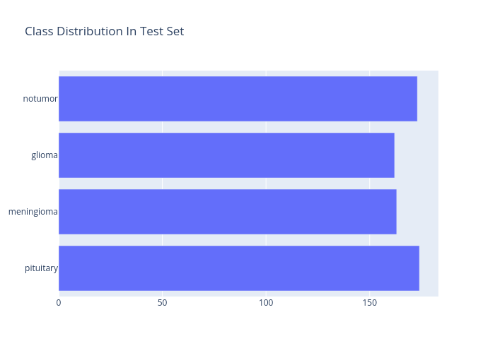
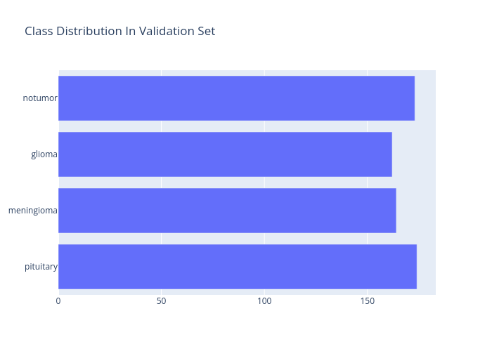

<h1>Brain Tumor Classification And Segmentation Using GradCAM</h1>

This project aims to employ the Gradient-Weighted Class
Activation Mapping(GradCAM) algorithm to understand how
Convolution Neural Networks(CNN's) make the decisions
they do by visualizing the feature extraction of the 
neural network.

## Language Used

## Libraries Used

# About The Dataset:

[Brain Tumor MRI Images](https://www.kaggle.com/datasets/masoudnickparvar/brain-tumor-mri-dataset/data)

This is a dataset containing a collection of 7023 MRI scans of the human brain in JPG format. The scans belong to 4 different diagnosis classes:
Gliomas, Meningiomas, Pituitary and no Tumors. The class distribution is fairly balanced, which eliminates the need of
oversampling/undersampling to counter class imbalances. However, some images had to be removed due to duplication.

### 1) Training Set Class Distribution

### 2) Testing Set Class Distribution

### 3) Validation Set Class Distribution

# Installation:

To setup this project, you'll need
